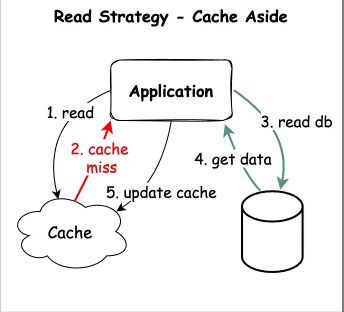
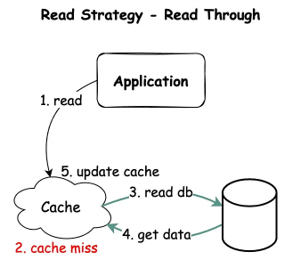
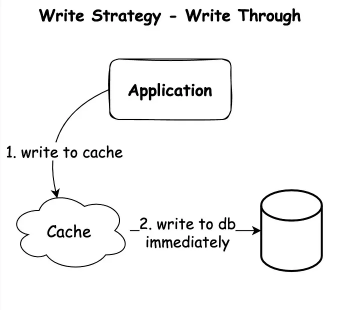
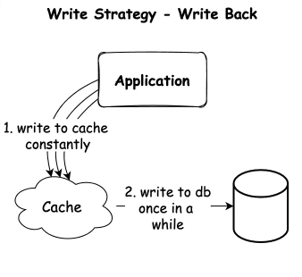
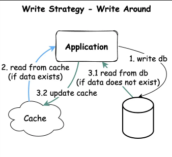

# VCS-Redis

## Overview
Redis (Remote dictionary server) là 1 kho lưu trữ dữ liệu mã nguồn mở chủ yếu được sử dụng như 1 cơ sở dữ liệu, cache và message queue. Redis được biết đến với khả năng sẵn sàng cao, độ trễ thấp và tính linh hoạt trong việc xử lý với nhiều kiểu dữ liệu khác nhau. Redis lưu trữ dữ liệu trên RAM thay vì trên ổ đĩa giúp việc xử lý dữ liệu nhanh hơn rất nhiều so với các cơ sở dữ liệu truyền thống khác.

Redis được sử dụng cho các mục đích sau:
* **Cache**: Tăng tốc ứng dụng bằng cách cache các dữ liệu xuất hiện thường xuyên.
* **Session Management**: Lưu trữ phiên của người dùng trên ứng dụng web.
* **Realtime Analytics**: Sử dụng trong bảng xếp hạng hoặc theo dõi số liệu
* **Pub-sub Messaging**: Hỗ trợ kiến trúc event driving.

## Caching
Redis hỗ trợ nhiều chiến lược cache để kiểm soát dữ liệu hiệu quả, tránh việc sử dụng bộ nhớ quá mức, và vẫn giữ lại được những dữ liệu được truy cập thường xuyên.
### Cache-Aside
Chiến lược này còn được gọi là lazy loading. Vùng nhớ cache (Redis) được chạy song song với database gốc, do đó ứng dụng có thể tương tác trực tiếp với cache và database.



#### Cách thức hoạt động:
1. Application kiểm tra trong Redis xem có lưu trữ dữ liệu mình cần không.
2. Khi cache không chứa dữ liệu mà application cần (cache miss), pplication sẽ xuống database để lấy dữ liệu.
3. Application sẽ lưu dữ liệu lấy được từ database để lưu vào cache.

#### Lợi ích:
1. Đảm bảo cache được các dữ liệu được truy cập thường xuyên.
2. Tránh việc lưu trữ các dữ liệu không cần thiết.
3. Ứng dụng có thể truy cập thoải mái vào cache và database. Nếu cache không hoạt động thì ứng dụng vẫn chạy bình thường.

#### Bất lợi:
1. Dữ liệu được truy cập lần đầu hoặc khi hết hạn tốn nhiều thời gian hơn.
2. Khi dữ liệu trong database thay đổi thì cache có thể không còn đúng.

### Read through
Thay vì ứng dụng phải kết nối với cả cache và database, **Read Through** cho phép ứng dụng chỉ cần truy cập vào cache, còn lại là do cache xử lý.



#### Cách thức hoạt động:
1. Ứng dụng gửi request đến cache để lấy dữ liệu
2. Nếu cache hit, cache sẽ gửi dữ liệu ngay lập tức cho ứng dụng.
3. Nếu cache miss, cache sẽ truy cập vào database để lấy dữ liệu, sau đó cập nhật dữ liệu của chính nó và gửi dữ liệu về cho ứng dụng.

#### Lợi ích
1. Ứng dụng không cần quan tâm đến việc cache dữ liệu, mọi thứ đều do cache xử lý.
2. Đảm bảo cache được các dữ liệu truy cập thường xuyên.

#### Bất lợi
1. Phụ thuộc nhiều vào cache, nếu cache không hoạt động thì dữ liệu cũng sẽ sập theo.
2. Không có quyền lựa chọn thời gian cache dữ liệu.
3. Khi dữ liệu trong database thay đổi thì cache có thể không còn đúng.

### Write-through cache
Khi ứng dụng cần ghi dữ liệu, thay vì ghi dữ liệu vào database, nó sẽ ghi vào cache trước và cache sẽ ghi vào database sau. Đây là cách ghi dữ liệu **đồng bộ (synchronously)**.



#### Cách thức hoạt động
Khi một request write tới:

1. Dữ liệu sẽ được lưu vào cache
2. Cache sẽ gửi yêu cầu lưu dữ liệu vào database ngay lập tức.

#### Lợi ích
1. Không xảy ra cache miss do dữ liệu luôn được ghi vào cache trước khi vào database.
2. Đồng nhất được cache và database.
3. Kết hợp được với read through cache.

#### Bất lợi
1. Hầu hết dữ liệu write đều chỉ dùng 1 lần nên dễ ghi các dữ liệu không cần thiết.
2. Chỉ thích hợp với write-heavy workloads.

### Write back
Thay vì cache ghi dữ liệu trực tiếp vào database khi nhận được request, cache sẽ đồng bộ dữ liệu xuống database định kì theo thời gian, hoặc theo số lượng dữ liệu được insert/update. Đây là cách ghi dữ liệu **bất đồng bộ (asynchronously)**.



#### Cách thức hoạt động
1. Dữ liệu sẽ được lưu vào cache
2. Sau một khoảng thời gian, cache sẽ ghi dữ liệu vào database.

#### Lợi ích
1. Giảm tải áp lực write xuống database, từ đó sẽ giảm được chi phí và các vấn đề liên quan tới database
2. Kết hợp được với read through cache.

#### Bất lợi
1. Eventual consistency, database có một khoảng thời gian không được đồng bộ với cache.
2. Nếu cache sập thì ứng dụng cũng sập và sẽ bị mất toàn bộ dữ liệu chưa kịp đồng bộ vào database.

### Write around



#### Cách thức hoạt động
1. Dữ liệu chỉ được ghi vào database.
2. Khi ứng dụng muốn đọc dữ liệu, đầu tiên sẽ đọc ở cache. Nếu cache hit thì trả dữ liệu về.
3. Nếu cache miss, ứng dụng sẽ đọc dữ liệu từ database.
4. Ứng dụng ghi dữ liệu vào cache.

#### Lợi ích
1. Tránh ghi các dữ liệu không cần thiết.
2. Phù hợp với dữ liệu không cần truy cập nhiều nhưng vẫn cần cache trong lúc đọc.

#### Bất lợi
1. Không xử lý được với dữ liệu được update nhiều.

## Data Structures
### 1. Strings (SET, GET)
Là kiểu dữ liệu cơ bản nhất trong Redis, lưu dữ liệu dưới dạng key-value. Thường dùng để cache các thông tin xuất hiện thường xuyên. Để cập nhật hay lấy giá trị của 1 key ta dùng **SET** và **GET**.
```redis
SET "user 123" "John Doe"		# OK
GET "user 123"						# John Doe
```
Để gán nhiều cặp key-value cùng lúc hay lấy nhiều giá trị của key trong 1 câu lệnh, ta dùng **MSET** và **MGET**.
```redis
MSET "user:1" "admin1" "user:2" "admin2"
# OK
MGET "user:1" "user:2"
# 1) "admin1"
# 2) "admin2"
```
Nếu giá trị value là 1 số nguyên, ta có thể tăng giá trị cho nó thông qua **INCR** và **INCRBY**. 2 hàm này đảm bảo tính atomicity, tức là chắc chắn thực hiện đúng kể cả khi key đó được tăng đồng thời từ nhiều lệnh.
```redis
INCR "user:1"
# (error) ERR value is not an integer or out of range

SET cnt 0
# OK
INCR cnt
# (integer) 1
INCRBY cnt 10
# (integer) 11
```

Độ phức tạp: Hầu hết các thao tác trên String đều có độ phức tạp O(1).

### 2. Lists (LPUSH, RPUSH, LPOP, RPOP, LRANGE)
Lưu trữ một tập hợp string, được cài đặt như một linked list. Thường được sử dụng như message queue hay hàng đợi cho job hoặc công việc

Các command cơ bản:
* **LPUSH**: Thêm 1 phần tử vào bên trái.
* **RPUSH**: Thêm 1 phần từ vào bên phải.
* **LPOP**: Xóa phần tử trái nhất.
* **RPOP**: Xóa phần tử phải nhất.
* **LLEN**: Trả về độ dài của list.
* **LMOVE**: Di chuyển 1 phần tử của 1 list sang list khác.
* **LRANGE**: Trả về 1 dãy con của list.
* **LTRIM**: Thay đổi dãy thành dãy con của chính dãy đó.

Ví dụ:
```redis
LPUSH tasks "task1" "task2" "task3"   # Push tasks to the left (like a stack)
LRANGE tasks 0 -1                     # Get all tasks
RPOP tasks                             # Pop a task from the right
```

Độ phức tạp: Giống linked-list, các thao tác thêm bớt phần tử vào list mất O(1), tuy nhiên các thao tác truy vấn giá trị sẽ mất tối đa O(N) với N là độ dài list.

### Sets (SADD, SREM, SMEMBERS)
Tập hợp các giá trị xâu (hoặc số) phân biệt.

Các command cơ bản:
* **SADD**: Thêm một phần tử vào set.
* **SREM**: Xóa một phần tử chỉ định ra khỏi set.
* **SISMEMBER**: Kiểm tra xem 1 string có nằm trong set không.
* **SINTER**: Trả về tập hợp các phần tử mà 2 hoặc nhiều SET đều có.
* **SCARD**: Trả về độ dài set.

Ví dụ:
```redis
SADD unique_users "user1" "user2" "user3" # Add 3 users
SMEMBERS unique_users"               # List all users
SREM unique_users "user2"              # Delete user2
SISMEMBER unique_users "user2"  # Check if user2 exists
```

Độ phức tạp: O(1) với hầu hết các thao tác thêm, xóa, kiểm tra 1 phần tử hay lấy độ dài của set. Tuy nhiên, thao tác SMEMBERS (liệt kê các phần tử trong set) mất O(N) nên tránh dùng khi set có độ dài lớn.

### Hashes (HSET, HGET, HGETALL)
Một key-value được lưu trữ trong 1 key (giống JSON). Thường sử dụng để lưu trữ dữ liệu người dùng hoặc cache.

Các command cơ bản:
* **HSET**: Gán một giá trị và một hoặc nhiều trường vào hash.
* **HGET**: Trả về giá trị của một trường.
* **HMGET**: Trả về giá trị của một hoặc nhiều trường.
* **HGETALL**: Trả về tất cả các trường và giá trị trong 1 hash.
* **HINCRBY**: Tăng giá trị của một trường được chỉ định.

Ví dụ:
```redis
HSET user:100 name "Alice" age 30 city "NY"
HGET user:100 name  # Get specific field
HGETALL user:100    # Get all fields
```

Độ phức tạp: O(1) với thao tác thêm hoặc lấy kết quả và O(N) với thao tác lấy tất cả giá trị trong hash.

### Sorted Sets (ZADD, ZRANGE, ZREM)
Giống Sets nhưng mỗi giá trị được gán điểm số, sort các giá trị theo điểm số đó. Thường dùng cho bảng rank hoặc sắp xếp các job theo thứ tự ưu tiên.

Các command cơ bản:
* **ZADD**: Thêm một phần tử với điểm số tương ứng vào một sorted set. Nếu phần tử đã tồn tại thì cập nhật lại điểm số.
* **ZRANGE**: Trả về các phần tử của một sorted set được sắp xếp trong 1 khoảng nào đó.
* **ZRANK**: Trả về rank của một phần tử trong một sorted set giá sử set được sort tăng dần.
* **ZREVRANK**: Trả về rank của một phần tử trong một sorted set giá sử set được sort giảm dần.

Ví dụ:
```redis
ZADD leaderboard 100 "player1"
ZADD leaderboard 200 "player2"
ZRANGE leaderboard 0 -1 WITHSCORES  # Get sorted players
```

Độ phức tạp: Sorted Sets sử dụng CTDL skip list, do đó độ phức tạp cho hầu hết các thao tác là O(log(N)) với N là số phần tử của sorted set, trong đó thao tác ZRANGE có độ phức tạp O(log(N) + M) với M là số phần tử trả về.

### Bitmaps (SETBIT, GETBIT, BITCOUNT)
Biểu diễn dữ liệu dưới dạng nhị phân.

Ví dụ:
```redis
SETBIT user_activity 1 1  # Mark user 1 as active
SETBIT user_activity 2 0  # Mark user 2 as inactive
BITCOUNT user_activity    # Count active users
```

Độ phức tạp: O(1) với các thao tác **SETBIT** và **GETBIT**. Các thao tác còn lại mất O(N) với N là độ dài của bitmap.

### HyperLogLog
Cấu trúc dữ liệu xác suất để đếm các phần tử duy nhất một cách hiệu quả.

Các command cơ bản:
* **PFADD**: Thêm một hoặc nhiều phần tử vào một HyperLogLog.
* **PFCOUNT**: Ước lượng số phần tử phân biệt trong một HyperLogLog.
* **PFMERGE**: Gộp nhiều HyperLogLog thành một HyperLogLog.

Cách hoạt động của HyperLogLog:
* Khi thêm một phần tử mới vào, phần tử đấy sẽ được hash ra một giá trị 64 bits.
* Sử dụng m = 2<sup>b</sup> thanh ghi, với b là số bit đầu ta chọn. Mỗi thanh ghi lưu tiền tố chỉ toàn 0 dài nhất của 64 - b bits còn lại.
* Đếm độ dài tiền tố 0 dài nhất của 64 - b bits còn lại, sau đó cập nhật giá trị của X trong hash, trong đó X là biểu diễn của b bits đầu.
* Hàm cập nhật giá trị cho hash là hàm MAX.
* Sử dụng công thức sau để ước lượng số lượng phần tử trong HyperLogLog:

Ví dụ:
```redis
PFADD unique_visitors "user1" "user2" "user3"
PFCOUNT unique_visitors  # Approximate count of unique users
```

Độ phức tạp: O(1) với PFADD và PFCOUNT, O(N) với PFMERGE với N là số lượng HyperLogLog cần merge.

### Bloom Filter
Bloom Filter là cấu trúc dữ liệu xác suất để kiểm tra xem một phần tử có tồn tại trong một tập hợp không với thời gian hằng số.
* Nếu Bloom Filter trả lời là không tìm thấy thì **chắc chắn** phần tử không xuất hiện trong tập hợp.
* Nếu Bloom Filter trả lời là có tìm thấy thì **có khả năng** phần tử đó đã xuất hiện trong tập hợp.

Do khi Bloom Filter trả lời sai thì cũng không ảnh hưởng nhiều (ví dụ khi tìm username trong Bloom Filter, nếu không tìm thấy thì chắc chắn username chưa tồn tại, và ta có thể tạo mới an toàn, còn nếu tìm thấy thì ta có thể kiểm tra lại database hoặc từ chối username đó).

Độ phức tạp:
* O(K) cho thao tác chèn, với K là số hàm hash.
* O(K * N) cho thao tác kiểm tra, với N là số Bloom Filters.

### Streams
Redis Stream là cấu trúc dữ liệu của Redis dùng để xử lý luồng dữ liệu thời gian thực, chỉ có thể thêm dữ liệu vào cuối (**append-only**) mà không thể xóa hay chỉnh sửa dữ liệu cũ.

#### Publish đến 1 stream
Để thêm phần tử mới vào stream, sử dụng lệnh **XADD**. Lệnh này sẽ thêm một phần tử chứa các cặp key-value vào stream được chỉ định. Redis sẽ trả về ID có thể được sử dụng sau này để tham chiếu đến giá trị đó.
```redis
XADD mystream * sensor-id 123 temperature 26
# 1744554483786-0
```
#### Consume từ 1 stream
Một consumer trong Redis sẽ đọc dữ liệu từ stream và xử lý chúng. Có thể có nhiều consumers đọc từ stream đồng thời để song song hóa việc xử lý dữ liệu.
```redis
XREAD COUNT 10 BLOCK 3000 STREAMS mystream 0-0
```

Để lấy tin nhắn gần nhắt được publish đến sau lệnh XREAD, ta thay 0-0 thành $.
```redis
XREAD COUNT 10 BLOCK 0 STREAMS mystream $
```

#### Consumer Group
Consumer groups là một tập hợp consumers để nhận tin nhắn, trong đó mỗi tin nhắn trong consumer chỉ được consume bởi duy nhất 1 consumer.
```redis
XGROUP CREATE mystream group_consumer 	# Tạo consumer group bát đầu từ tin nhắn kế tiếp
XGROUP CREATE mystream group_consumer 0	# Tạo consumer group bát đầu từ tin nhắn đầu tiên
```
#### Đọc từ một Consumer Group
Tạo một consumer mới để đọc stream.
```redis
XREADGROUP GROUP group_consumer consumer1 STREAMS my_stream >	# Đọc tin nhắn chưa được consume bởi bất kỳ consumer nào trong group
```

#### Acknowledge một tin nhắn
Khi tin nhắn được xử lý thành công từ một consumer thì phải cần được acknowledge. Lệnh **XACK** xóa tin nhắn khỏi danh sách tin nhắn đang được PENDING, thông báo rằng tin nhắn được xử lý thành công và không cần phải gửi lại.
```redis
XACK mystream group_consumer ''message_id''
```

#### Thông báo tin nhắn không được xử lý thành công
Nếu 1 consumer không acknowledge tin nhắn trong 1 khoảng thời gian, tin nhắn đó vẫn sẽ nằm trong danh sách PENDING. Khi đó ta có thể thông báo để consumer khác có thể nhận tin nhắn đó.
* **XPENDING**: Kiểm tra có những tin nhắn nào vẫn đang bị Pending.
* **XCLAIM**: Đổi consumer xử lý tin nhắn chỉ định khi thời gian PENDING quá bao lâu.

## Transaction
Transaction là cách để gộp các command thành 1 khối command duy nhất, được xử lý tách biệt.

Các lệnh dùng trong transaction:
* **MULTI**: Bắt đầu một khối transaction.
* **EXEC**: Thực thi tất cả các command bắt đầu từ **MULTI**.
* **DISCARD**: Loại bỏ transation (Không command nào được thực thi)
* **WATCH**: Theo dõi một hoặc nhiều giá trị. Nếu một trong số các giá trị thay đổi, transation không được thực thi.

Ví dụ:
```redis
MULTI
# OK
SET user:1:name "Alice"
# QUEUED
INCR user:1:points
# QUEUED
EXEC
# 1) OK
# 2) "Alice"
```

```redis
MULTI
# OK
SET user:1:name "Alice"
# QUEUED
INCR user:1:points
# QUEUED
EXEC
# OK
```

## Redis Persistence
Redis hỗ trợ 2 lựa chọn để lưu lại dữ liệu vĩnh cửu là **Redis Database (RDB)** và **Append-Only File (AOF)**.
### RDB
### AOF